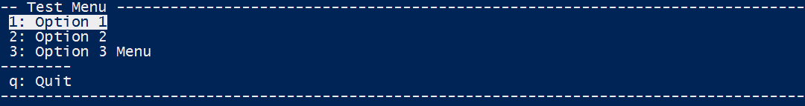
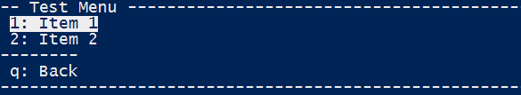
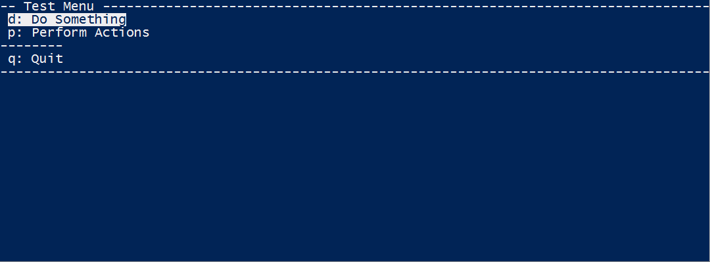

SLMenu
======
A Powershell (v3+) text user interface library.

  * [Menu](#menu)
  * [Status](#status)
  * [Misc](#misc)

[](https://ci.appveyor.com/project/SteveLowe/slmenu)


Menu
----
SLMenu can be used to create an interactive menu, and either execute code or return data when an option is selected.

The menu can be navigated using the cursor keys and enter, or using the key for each line.

```powershell
$MenuItems = @(
  New-SLMenuItem -Key '1' -Name 'Option 1' -Data { Invoke-Option1 }
  New-SLMenuItem -Key '2' -Name 'Option 2' -Data { Invoke-Option2 }
  New-SLMenuItem -Key '3' -Name 'Option 3 Menu' -Data { Show-Option3Menu }
  New-SLMenuItem -Separator
  New-SLMenuItemQuit
)
Show-SLMenuExecute -MenuItems $MenuItems -Title 'Test Menu' -Clear
```


For more detailed help with each function, use Get-Help within powershell.  
Also see Examples.ps1 above.

### Show-SLMenu
Show the menu on the screen and return the selected item.


### Show-SLMenuExecute
As Show-SLMenu, and execute the selected item.  
The -Data param of all MenuItems must be a ScriptBlock.


### Show-SLMenuYesNo
Shows a menu with Yes/No options, and returns $true/$false


### New-SLMenuItemList
Returns a new PSObject list (System.Collections.Generic.List[PSObject]).  
This is to make it easier to create a dynamic list of MenuItems.
```powershell
$MenuItems = New-SLMenuItemList
$MenuItems.Add( (New-SLMenuItem -Key '1' -Name 'Item 1' -Data 1) )
if ($IncludeTwo) {
  $MenuItems.Add( (New-SLMenuItem -Key '2' -Name 'Item 2' -Data 2) )
}
$MenuItems.Add( (New-SLMenuItem -Separator) )
$MenuItems.Add( (New-SLMenuItemQuit -Name 'Back') )

Show-SLMenu -MenuItems $MenuItems -Title 'Test Menu'
```



### New-SLMenuItem
Create a new Menu item.  
There are 3 mandatory parameters;  
  -Key [char] - which key to press to select the menu  
  -Name [string] - the label shown for the menu  
  -Data [object] - what to return if this item is selected 

There are two special Menu Items that can be created:
#### -Comment
This is a non-selectable menu item that shows the label (-Name). The label is 
not indented.

#### -Separator
This is a non-selectable menu item the is intended to separate groups of menu items.
It shows just '--------'.


### New-SLMenuItemQuit
This creates a menu item, intended to be used to quit from a menu.  
It will return $null for -Data.  
-Name will default to 'quit', but can be overridden.  
It will bind they keys q, Q, ESC, and Ctrl-c.


### New-SLMenuItemListFromEnum
Creates a list of MenuItems, and populates it with all values in a Enum.  
-Include and -Exclude can be used to filter the list


### Get-SLMenuChar
Will turn an integer into a printable character.  
-MenuNumber should be between 1 and 59


### Nesting Menus
You can easily nest menus my wrapping a function around a menu, and using Slow-SLMenuExecute
```powershell

function Show-SubMenu1 {
  $MenuItems = @(
    New-SLMenuItem -Key '1' -Name 'One' -Data 1
    New-SLMenuItem -Key '2' -Name 'Two' -Data 2
  )
  Show-SLMenu -MenuItems $MenuItems -Title 'Test Menu' -Clear  
}

function Show-SubMenu2 {
  $MenuItems = @(
    New-SLMenuItem -Key '1' -Name 'Eleven' -Data 11
    New-SLMenuItem -Key '2' -Name 'Twelve' -Data 12
  )
  Show-SLMenu -MenuItems $MenuItems -Title 'Test Menu' -Clear  
}

$MenuItems = @(
  New-SLMenuItem -Key '1' -Name 'SubMenu 1' -Data { Show-SubMenu1 }
  New-SLMenuItem -Key '2' -Name 'SubMenu 2' -Data { Show-SubMenu2 }
  New-SLMenuItem -Separator
  New-SLMenuItemQuit
)

Show-SLMenuExecute -MenuItems $MenuItems -Title 'Test Menu' -Clear -LoopAfterChoice
```


Status
------
These two functions provide a way to show status information.



It can be used like:
```powershell
Write-SLLineState
Write-SLLineText 'Task Name'
try {
  Invoke-TaskName
  Write-SLLineState -Ok -Next
}
catch {
  Write-SLLineState -Fail -Next
  # Handle error
}
```

### Write-SLLineState
Write the status part of the line e.g."[ ok ]"

There are several pre-defined message:

    -OK
    -Warn
    -Fail
    -None
    -Dots

or you can use your own text with:  

    -Message 'My Message'

if you don't use any params, then dots '....' will be used


### Write-SLLineText
Write text after the status block. This function will make sure the text does
not overlap the status block, and does not wrap to the next line.


Misc
----

### Clear-SLConsoleLine
Clear (by writing spaces) the curent line, optionally from the start, and optionally repeat for multiple lines.
```powershell
> Clear-SLConsoleLine -FromStart -Return -Count 5

# -FromStart: Move back to the start of the current line first
# -Return: Move back to original cursor position after clearing
# -Count: Clear this number of lines (default 1)
```

### Move-SLConsoleCursor
This provides several ways to move the cursor around the screen.
```powershell
Move-SLConsoleCursor -CursorPosition $CursorPosition
# This requires a Management.Automation.Host.Coordinates object (from $Host.UI.RawUI.CursorPosition)

Move-SLConsoleCursor -X $x -Y $y
# Move to position $x, $y
# -X and -Y are optional (but you should provide one)

Move-SLConsoleCursor -Up $u -Down $d -Left $l -Right $r
# Move relative to current position
# All parameters are optional (again, you should provide at least one)
```
